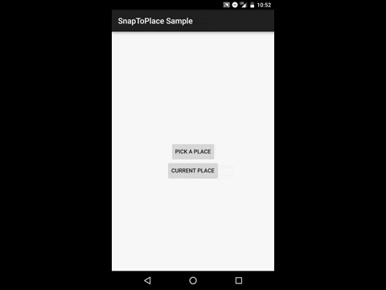
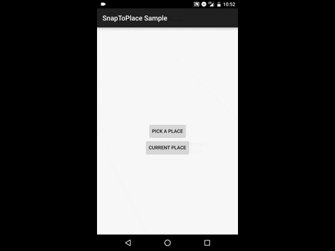
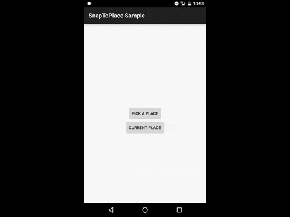

Place Picker SDK
==================
An SDK to help developers add a place picker to their app and also quickly access the Foursquare place that their user is at.

Download
----------
```groovy
compile 'com.foursquare:placepicker:0.5.7'
```

Demo
----------

<br/>

<br/>


Usage
----------

Initialize the SDK with your consumer key and secret.

```java
PlacePickerSdk.with(new PlacePickerSdk.Builder(this)
                .consumer(CONSUMER_KEY, CONSUMER_SECRET)
                .imageLoader(new PlacePickerSdk.ImageLoader() {
                    @Override
                    public void loadImage(Context context, ImageView v, String url) {
                        Glide.with(context)
                                .load(url)
                                .placeholder(R.drawable.category_none)
                                .dontAnimate()
                                .into(v);
                    }
                })
                .build());
```

If you want to get the current place of your user:
```java
private void getClosestPlace() {
    PlacePickerSdk.get().getCurrentPlace(new PlacePickerSdk.CurrentPlaceResult() {
        @Override
        public void success(Venue venue, boolean confident) {
            Toast.makeText(MainActivity.this,"Got closest place " + venue.getName() + " Confident? " + confident, Toast.LENGTH_LONG).show();
        }

        @Override
        public void fail() {
        }
    });
}
```

To launch the place picker, open the intent and handle the result in onActivityResult():
```java
private void pickPlace() {
    Intent intent = new Intent(this, PlacePicker.class);
    startActivityForResult(intent, 9001);
}

@Override
protected void onActivityResult(int requestCode, int resultCode, Intent data) {
    if (resultCode == PlacePicker.PLACE_PICKED_RESULT_CODE) {
        Venue place = data.getParcelableExtra(PlacePicker.EXTRA_PLACE);
        Toast.makeText(this, place.getName(), Toast.LENGTH_LONG).show();
    } else {
        super.onActivityResult(requestCode, resultCode, data);
    }
}
```